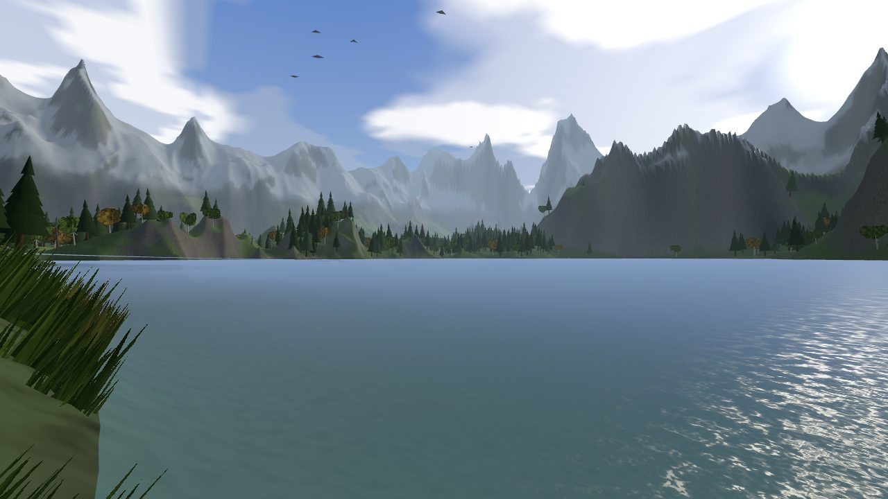
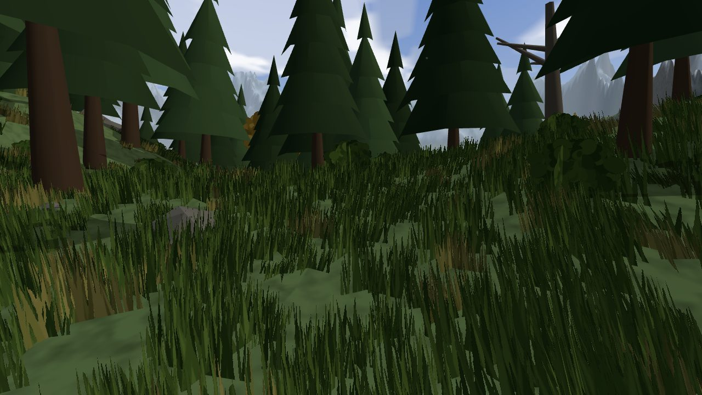
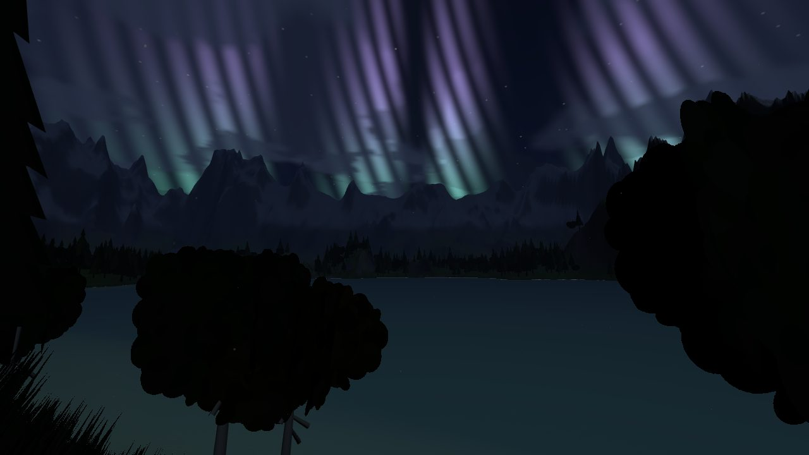
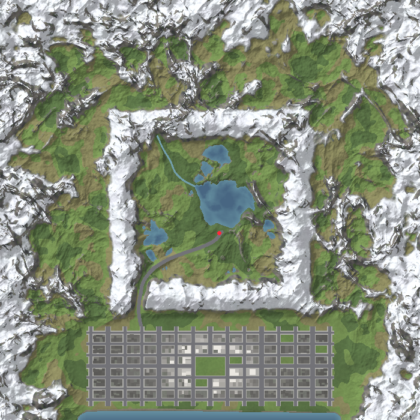

# Openworld

A procedurally generated northern valley — and, over the pass to the south, a
city on the bay. Two places, one world: the same height field, the same player,
the same hoverboard. You start on the lake shore with the mountains around you,
and if you follow the road south for a kilometre you come out of a gorge onto a
plain with a skyline on it.

Built with three.js and WebXR, aimed at the Quest 3 browser but playable on a
desktop too. There is no build step and nothing is downloaded at runtime — every
texture, tree, rock, window and blade of grass is generated from a seed when the
page loads.



| | |
|---|---|
|  |  |

## Running it

WebXR needs a secure context, so it has to be `https://` or `localhost` — opening
`index.html` straight off the filesystem will not work.

```sh
git clone <this repo>
cd Openworld
python3 -m http.server 8000
```

Then open `http://localhost:8000`. On desktop, press **Explore on desktop**.

For the headset, publish it somewhere with https (GitHub Pages works — Settings →
Pages → deploy from branch, root folder) and open that URL in the Quest browser.
The **Enter VR** button lights up once a headset is detected.

Detail level can be overridden with `?q=low`, `?q=medium` or `?q=high`, or with
the buttons on the start screen. Medium is what a Quest 3 wants; high is for a
desktop GPU.

## Controls

**Quest 3 / any WebXR controllers**

| Input | On foot | On the hoverboard |
|---|---|---|
| Left stick | Move, relative to where you are looking | Throttle and steer |
| Left grip | Sprint | Boost |
| Right stick ← → | Smooth turn | Steer |
| Right trigger | — | Upward thrust |
| Right **A** | Jump | — |
| Right **B** | Mount the hoverboard | Dismount |
| Left **Y** | Cycle time of day | Cycle time of day |

Room-scale is honoured: the rig's origin is your feet and the headset supplies the
height on top, so crouching and leaning are real. There is a small readout on your
left wrist with the clock, your heading, your altitude and where you are.

**Desktop**

`W A S D` to move, mouse to look (click to capture, `Esc` to release), `Shift` to
sprint or boost, `Space` to jump or thrust, `E` to mount and dismount the board,
`T` for time of day, `M` to mute.

## What's in the world



The world is 2560 m square. The valley occupies the middle 1024 m of it and is
untouched from the version that came before — the terrain function for that box
is written against its own half-extent, so widening the world moved nothing in
it. You still start at the red dot on the south shore, looking north over the
water.

**The valley.** Ground is coloured and planted by biome, which follows from
altitude, slope and a moisture field that runs wetter near water and drier as you
climb: a lake and its tarns at sea level with reed beds in the shallows, a river
falling out of the northwest mountains, pine forest through the damp middle
ground mixed with birch and the odd autumn tree, moor and meadow where it is
drier, scree and lichen-stained rock on the steep ground, and snow above ~84 m.

**The pass.** A road leaves the south shore beside the spawn, runs southwest
across the meadows, and climbs into a gorge cut through the valley rim — the
terrain is graded to the road's design profile, which is what opens the canyon.
It tops out around 42 m with walls 100 m above it, then drops onto the plain.
There are lamps the whole way, so after dark the route out is a line of light you
can see from the lake shore.

**The city.** 1.4 km across and 400 m deep, on a plain at the foot of the
escarpment, with a bay open to the southern horizon. Avenues run north–south
every 104 m, streets east–west every 68 m, every third avenue twice as wide.
Around 490 buildings in six styles, tallest ~210 m, arranged by district: glass
and stone towers downtown, mid-rise around them, brick and warehouses out at the
edges, sheds along the quay. Four blocks in the middle are one park, planted from
the same tree set as the valley forest. There is a plaza with a stepped spire on
it, a promenade, four timber piers over the water, traffic on the grid, air
shuttles crossing overhead, and about nine hundred street lamps.

**The city is solid.** Roofs, setbacks, terraces and the piers are floors you can
stand on; a wall is simply a step too tall to climb. The hoverboard rides
whatever surface is beneath it and cannot fly through a building — hit one at an
angle and you slide along the facade. Landing on a roof and walking to the
parapet works, and so does falling off it.

A full day passes in fifteen minutes. Windows, street lamps, headlights and the
red beacons on the tall masts come up as the sun goes down. Wind moves through
the trees and grass on a slow gust cycle, and the ambience — wind, water, birds,
footsteps, traffic rumble, the odd horn — is synthesised with WebAudio rather
than sampled.

## How it fits together

```
index.html          import map + start screen
src/
  noise.js          seeded simplex, fBm, ridged noise
  world.js          the height field, river spline, biomes, ground colour
  citymap.js        the city plan: grid, blocks, buildings, zones — pure math
  city.js           the city as geometry: merged surfaces, traffic, lights
  config.js         quality presets and player tuning
  terrain.js        chunked LOD terrain with skirts
  scatter.js        instanced trees / rocks / undergrowth
  water.js          lake, river, bay and open sea, and their shader
  sky.js            sky dome, day-night palette, sun/moon, aurora, lighting
  assets.js         procedural textures and geometry, including the city atlas
  materials.js      shared materials, the wind shader and the atlas shader
  particles.js      motes, snow, fireflies, birds
  player.js         locomotion and physics
  hoverboard.js     the vehicle, its flight model and its collisions
  audio.js          synthesised ambience
  ui.js             overlay, HUD, wrist panel
  main.js           build sequence and frame loop
tools/preview.mjs   renders a top-down map of the world to a PNG
vendor/three/       three.js r185 (MIT), vendored so there is no build step
```

A few things worth knowing if you want to change it:

**`world.js` and `citymap.js` are the whole world, and neither imports three.js.**
That is what lets `tools/preview.mjs` run them under node and render the map
straight to a PNG. If you are tuning terrain or the city layout, iterate there —
it takes a couple of seconds instead of a page reload:

```sh
node tools/preview.mjs 640 tools/preview.png
```

**The height field is four surfaces stacked in order.** Mountains everywhere,
then the city's plain lerped over them, then the valley lerped over that, then
the highway graded into whatever came out. The valley's weight is exactly 1
inside its own box, so it is bit-for-bit what it always was; the city's plain
weight is exactly 1 under every paved surface, which is what lets the roads be
flat quads laid on the same function the terrain is built from.

**The city is one material.** Facades, roofs, tarmac, pavement and decking all
live in a single 4×4 atlas. An atlas normally cannot tile, so the tiling happens
in the shader: geometry carries UVs measured in repeats (bays across, floors up)
plus a per-vertex `aAtlas` rectangle, and the fragment shader wraps with `fract`
and samples with explicit derivatives so the mip level stays right across the
seam. Buildings are merged into one mesh per 128 m cell, which frustum-culls
well; the whole downtown is a couple of dozen draw calls.

**Nothing in the city is lit by a real light.** Lit windows are an emissive map
on the same atlas; lamps, headlights and mast beacons are additive unlit
geometry. All of it fades up with `1 - daylight`, so a night skyline costs
exactly what a daytime one does.

**Terrain is a fixed 20×20 grid of 128 m chunks**, each tessellated according to
its distance from you, with a short downward skirt at the edges so two
neighbouring detail levels can't show a crack of sky between them. Chunks past
the view distance — where the fog is already opaque — are hidden rather than
drawn. Geometry is built on a per-frame time budget and cached.

**Scattering works in cells.** Each cell decides once, deterministically, what
grows in it, and the result is cached; whatever is in range gets packed into a
handful of `InstancedMesh`es. It asks `citymap.js` what is underfoot, so nothing
sprouts through the tarmac and the parks get planted properly.

**Wind is one vertex shader.** Every plant carries an `aFlex` attribute that is 0
at the root and 1 at the tip; `materials.js` patches the Lambert vertex shader to
push those vertices along a world-space gust vector, rotated back into each
instance's local frame so everything leans the same way.

**The player walks on exactly what is drawn.** Ground height is sampled
bilinearly on the same grid the highest detail level uses, or the top of whatever
the city built there, whichever is higher.

There is a debug handle on `window.openworld`:

```js
openworld.downtown()          // jump to the middle of the city
openworld.pass()              // jump into the gorge
openworld.teleport(96, -36)   // or anywhere: the middle of the lake
openworld.setTime(0.95)       // 0 = midnight, 0.5 = noon
openworld.perf                // CPU cost per frame, excluding the draw call
```

## Performance notes

Everything is tuned around holding 90 Hz on a Quest 3 at the medium preset:
Lambert materials rather than PBR, alpha-tested cards rather than blended ones,
fake contact-shadow discs instead of a shadow map that could never resolve a
kilometre, one atlas and one material for the entire city, no dynamic lights
anywhere, fixed foveation on, and instancing everywhere. Terrain and scatter work
is spread across frames on a millisecond budget so streaming never stalls a
frame, and the city is built once during the loading screen and never touched
again except for the traffic.

## Credits

three.js r185, MIT licensed, vendored under `vendor/three/`. The hoverboard model
is under `assets/models/hoverboard/`. Everything else here is generated at
runtime.
